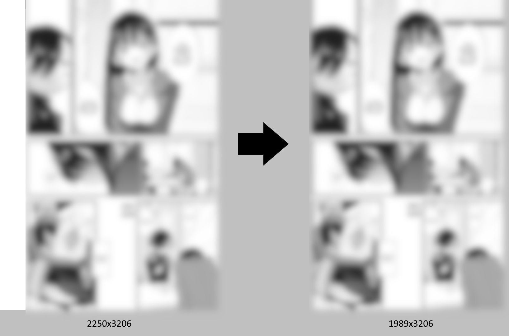

# What is this?
A Python script that crops borders from images.

# Features
* Reads JPEGs and PNGs
* Saves to PNG and AVIF
* Works on color and grayscale images
* Processes a single file or a whole directory recursively
* Resizes to fit a certain width
* Adjustable thresholds for noise insusceptibility
* Multi-core processing
* Auto-detects a grayscale image and saves it as such
# Requirements
Python, Pillow and Numpy. The current version has been tested with Python 3.12.2, [Pillow](https://pypi.org/project/pillow/) 10.3.0 and [Numpy](https://pypi.org/project/numpy/) 1.26.4. It may work on other versions.

[External AVIF encoder](https://github.com/AOMediaCodec/libavif) is required to save images to AVIF.
# How to use
```
usage: autocrop.py [-h] -i INPUT -o OUTPUT [-fr FILLRATIO] [-cd COLORDISTANCE] [-et EXHAUSTIVETHRESHOLD]
                          [-rct RGBCOLORTHRESHOLD] [-nr] [-rf] [-rw RESIZEWIDTH] [-rh RESIZEHEIGHT]
                          [-vrt VERTICALRESIZETARGET] [-hrt HORIZONTALRESIZETARGET] [-ea] [-aep AVIFEXECUTABLEPATH]
                          [-eq ENCODEQUALITY] [-pcl PNGCOMPRESSIONLEVEL] [-lp LOGPATH] [-nw]

Semi-automated border cropper

options:
  -h, --help            show this help message and exit
  -i INPUT, --input INPUT
                        Input file or directory
  -o OUTPUT, --output OUTPUT
                        Output directory template
  -fr FILLRATIO, --fillratio FILLRATIO
                        Border fill ratio in % (0.0 to 100.0, default=0.4)
  -cd COLORDISTANCE, --colordistance COLORDISTANCE
                        How many colors to treat as a background color (0 to 255, default=16)
  -et EXHAUSTIVETHRESHOLD, --exhaustivethreshold EXHAUSTIVETHRESHOLD
                        How much of a border must be cropped to not trigger exhaustive pass in % (0.0 to 100.0,
                        default=-1, disabled=-1, always=0)
  -rct RGBCOLORTHRESHOLD, --rgbcolorthreshold RGBCOLORTHRESHOLD
                        How much difference between bands is allowed to save a RGB image as grayscale (0 to 255,
                        default=9, always=255)
  -nr, --noresize       Disable resizing
  -rf, --resizefit      Enable fit resizing instead of fit only width
  -rw RESIZEWIDTH, --resizewidth RESIZEWIDTH
                        Target width for fit resizing
  -rh RESIZEHEIGHT, --resizeheight RESIZEHEIGHT
                        Target height for fit resizing
  -vrt VERTICALRESIZETARGET, --verticalresizetarget VERTICALRESIZETARGET
                        Width resize target for vertical images (default=1200)
  -hrt HORIZONTALRESIZETARGET, --horizontalresizetarget HORIZONTALRESIZETARGET
                        Width resize target for horizontal images (default=1920)
  -ea, --encodeavif     Enable encoding to AVIF
  -aep AVIFEXECUTABLEPATH, --avifexecutablepath AVIFEXECUTABLEPATH
                        Path to Avifenc executable (default=script directory)
  -eq ENCODEQUALITY, --encodequality ENCODEQUALITY
                        Encode quality (0 to 100, default=54)
  -pcl PNGCOMPRESSIONLEVEL, --pngcompressionlevel PNGCOMPRESSIONLEVEL
                        PNG compression level (0 to 9, default=1)
  -lp LOGPATH, --logpath LOGPATH
                        Log file path (default=script directory/autocroplog.txt)
  -nw, --nowait         Do not wait for a key press after completion
  ```
## Important settings
### Cropping
The options `-fr` (fill ratio), `-cd` (color distance), and `-et` (exhaustive pass threshold) are used to determine how aggressive the cropping will be performed. In essence, increasing `-fr` may help with high contrast noise on a border, `-cd` - with low contrast noise, `-et` (disabled by default) - with sporadic noise only on some lines or in the very beginning of an image.

If your images have clean borders, you can try to leave these settings on defaults and check results, they're quite safe on images.

If you have noisy borders, then you may have to increase these values slightly, check the results and adjust them to get desired images. Don't increase then too much as very high values will corrupt the results very easily.

If you want to know more of what exactly these parameters do, please read the "How does it work?" section.
### Resizing
The resizing resolution can be controlled using the -nr (disables resizing) -vrt (sets the target width for a vertical/portrait image) -hrt (sets the target width for a horizontal/landscape image). The resizing algorihm implemented now is not a "fit" one, but something like "fit width for a rotating screen". So for example for `-vrt 1200` and `-hrt 1920` a source `2000x3000` image will become a `1200x1800` image, and `3000x2000` will become `1920x1280`.

For a more traditional "fit" resizing enable the `-rf` switch and set the desired resolution using the `-rw` (for width) and `-rh` (for height) arguments.
## Examples
Process a directory `R:\Input` with default thresholds and save files to `R:\ResultPng` and `R:\ResultAvif`; use avifenc.exe from a script's directory, save log to a script's directory `autocroplog.txt`:

`python autocrop.py -i R:\Input -o R:\Result -ea`

Process a single file `R:\test.png` with default thresholds, don't encode to AVIF, don't resize, save to `R:\OutputPng`, save log to `R:\alog.txt`:

`python autocrop.py -i R:\test.png -o R:\Output -lp R:\alog.txt -nr`

Process a directory `R:\Input`, set fill ratio to 2%, set color distance to 32 colors, set exaustive pass threshold to 5%, save only in PNG to `R:\SavesPng`, don't wait on exit:

`python autocrop.py -i R:\Input, -o R:\Saves -fr 2 -cd 32 -et 5 -nw`

Process `R:\test.png`, fit the image to `1920x1080`, don't encode to AVIF and save to `R:\SavePng`:

`python autocrop.py -i R:\test.png -o R:\Save -rf -rw 1920 -rh 1080`
# How does it work?
## Cropping
The script loads an image and converts it into a grayscale/luminance-only form. Then it starts processing it line-by-line (row or coulumn, depends on what side of an image is being cropped).

It counts every unique luminance value in the line and how many pixels uses it. The most used luma value becomes a background luma value. But luma values that are neighbors to the background value are treated similarly: this is controlled by the `-cd` setting (by an absolute value). So if 255 was determined to be the background value, then (if `-cd` is set to 16) all luma values from 239 to 255 are treated as background. And if the background is 128, then the background range is 112-144. This may help to reduce errors from JPEG artifacts and low contrast noise.

Then the script counts all pixels in the line that have a luma value that belongs to the background range. Then it checks whether the portion of non-background pixels exceeds the "fill ratio" (`-fr` setting, may help with high contrast noise or unnecessary details, such as page numbers) percentage or not. If it doesn't, then the line still belongs to the border and the script starts checking the next line. If it does, then the scripts stops analyzing at this line and crops the detected border.

Left, right, top and bottom sides are analyzed separately from an outer egde towards center.

The `-et` option enables the exhaustive cropping mode (it functions on left and right borders only currently). If percentage of cropped lines is below the `-et` value, then the script starts the exhaustive pass. The difference from the previous pass is now the script doesn't stop on a first line that exceeds the fill ratio. Instead, it proceeds to analyze all lines.
## Saving
The `-o` option sets a template for output directories. Then the script generates the directory names by adding `Png` for PNGs and `Avif` for AVIFs. Also, the script creates output directories for the last subdirectory of an input file. For example, if `-o` is set to `R:\Output`, `-i` is set to `R:\Input`, and the file `R:\Input\SomeDir1\SomeDir2\test.png` is processed, then the file will be saved as `R:\OutputPng\SomeDir2\test.png` as a PNG and `R:\OutputAvif\SomeDir2\test.png` as an AVIF.

## AVIF encoding
This script uses an external AVIF encoder because the Pillow AVIF Plugin was always outdated and was restricted to multithreaded processing (the script forces avifenc to use a single thread). After the script has saved an image in PNG, it passes parameters to the avifenc using the saved PNG as source, executes it and waits for it to complete.
# Suggestions / bugs?
Please open an issue if you have an idea (maybe good heurisics to automatically set parameters for each image?😁) or spotted a bug.